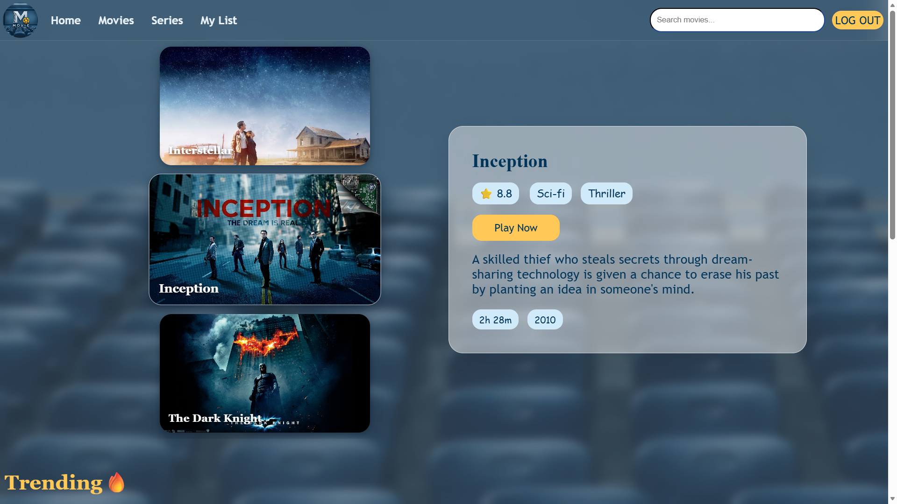
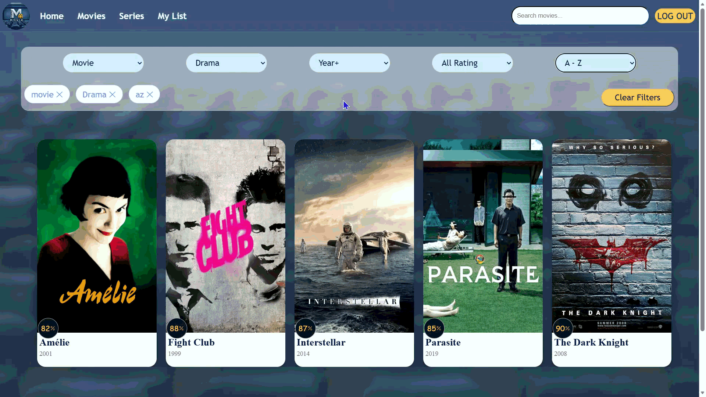
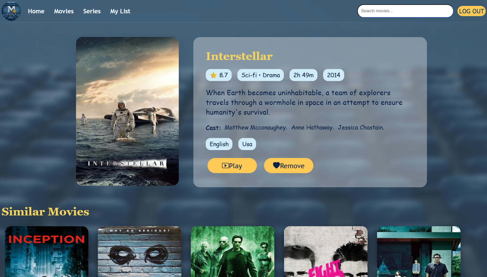
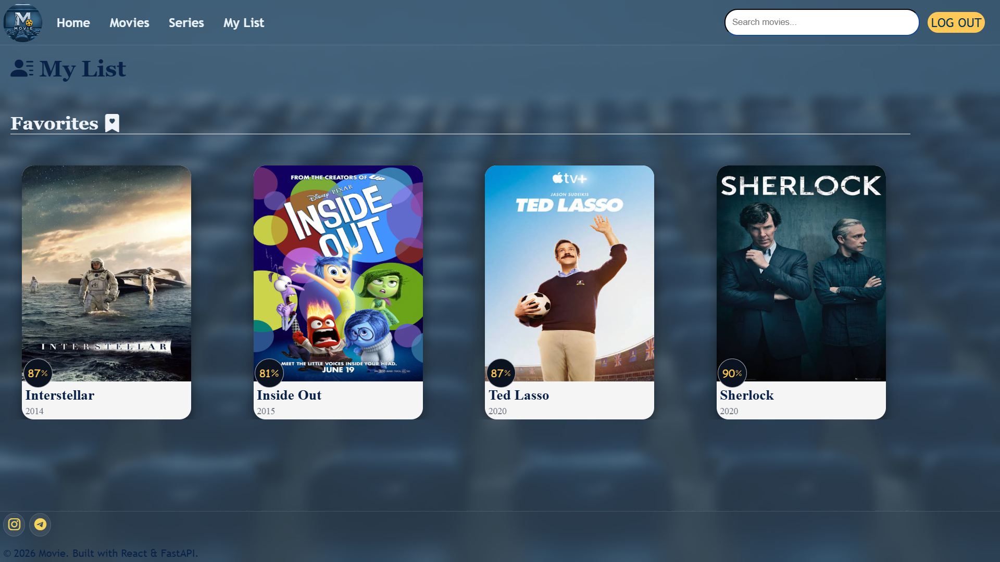
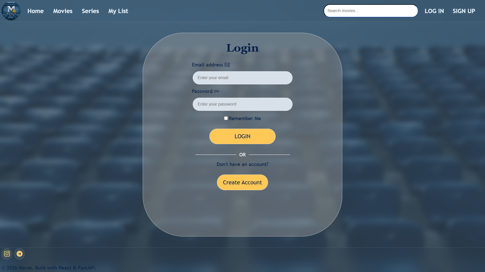
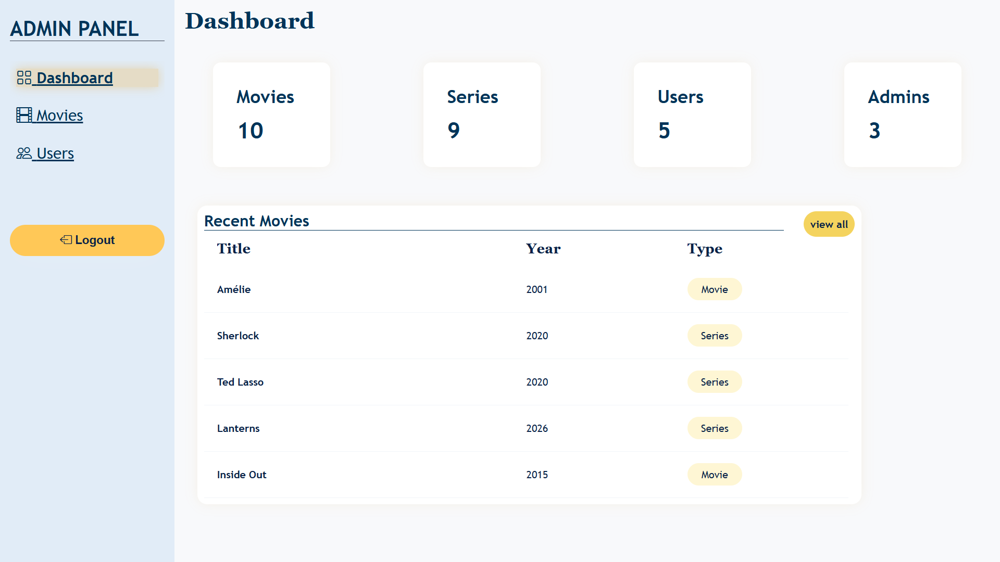
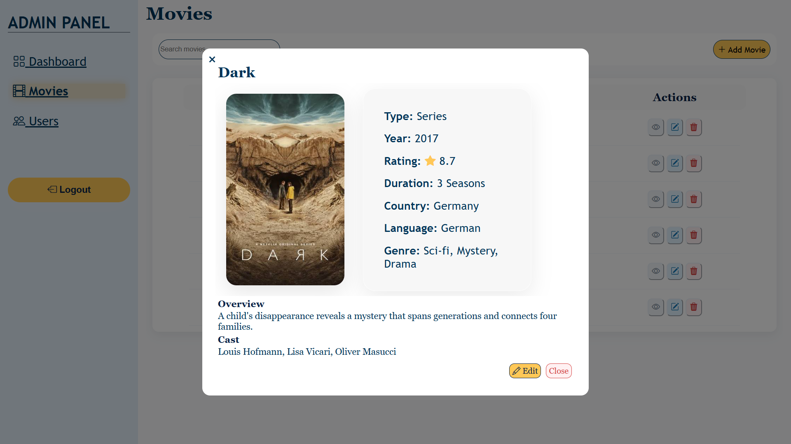
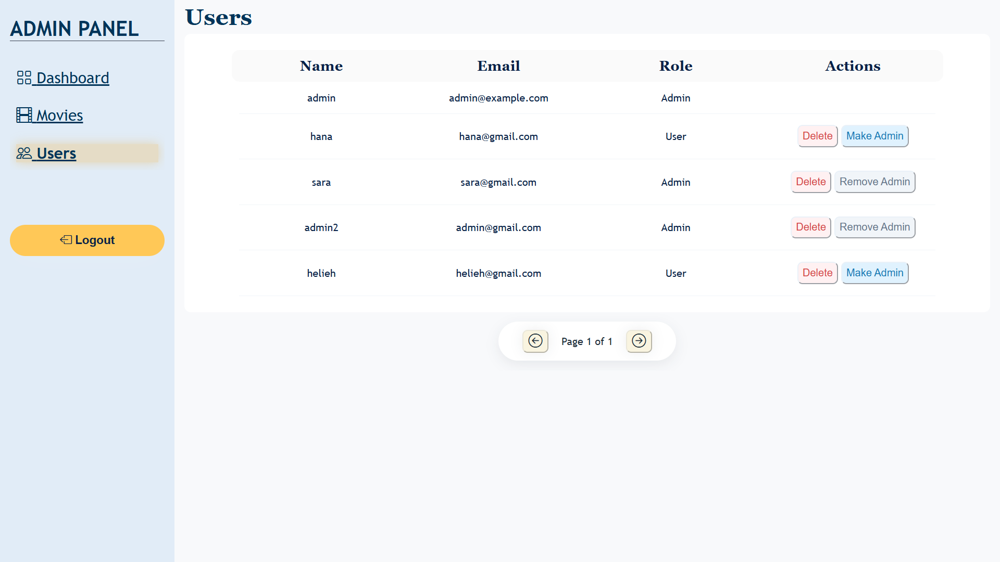

# Movie Platform
A full-stack movie platform developed as a bachelor's final project using React and FastAPI.

# About the Project
Movie Platform is a web application for browsing and managing movies.
Users can explore movies, search and filter them, view movie details, and save their favorite movies.
The project also includes an Admin Panel for managing movies and users.

# Features
### 👤 User Features
User registration and login,
JWT-based authentication,
Browse movies,
Search movies,
Filter movies by: Genre, Type, Year, Rating, Sort movies.
View movie details,
Add and remove movies from favorites,
My List page,
Similar movie recommendations,
### 🔐 Admin Features
Admin authentication and authorization,
Admin dashboard,
Movie management,
Add new movies,
Edit movies,
Delete movies,
View users,
Promote users to admin,
Remove admin privileges from users,
Movie list pagination.

## Technologies

### Frontend

* React
* Vite
* React Router
* JavaScript
* CSS
* Bootstrap Icons

### Backend

* FastAPI
* SQLAlchemy
* Pydantic
* JWT Authentication
* Passlib / Bcrypt

### Database & Tools

* SQLite
* Alembic
* Git & GitHub


## 🚀 Installation & Setup

### Backend

1. Navigate to the backend directory.

2. Create and activate a virtual environment:

```bash
python -m venv venv
```

On Windows:

```bash
venv\Scripts\activate
```

3. Install the required dependencies:

```bash
pip install -r requirements.txt
```

4. Run the database migrations:

```bash
alembic upgrade head
```

5. Start the FastAPI development server:

```bash
python -m fastapi_cli dev app/main.py
```

The backend will run at:

```text
http://127.0.0.1:8000
```

### Frontend

1. Navigate to the frontend directory:

```bash
cd frontend
```

2. Install the dependencies:

```bash
npm install
```

3. Start the development server:

```bash
npm run dev
```

The frontend will run at:

```text
http://localhost:5173
```


## Screenshots

Here are some screenshots of the application:

<p align="center">
  
  
</p>

<p align="center">
  
  
</p>

<p align="center">
  
</p>

<p align="center">
  
  
</p>

<p align="center">
  
</p>
